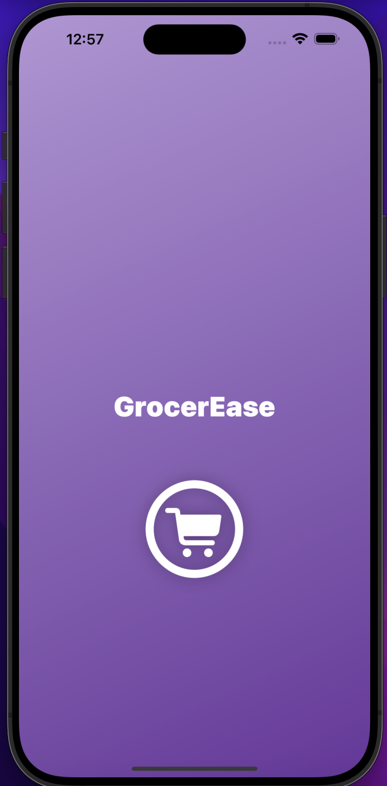

# GrocerEase

## App SnapShots

| Launch | Welcome | Categories |
| -- | -- | -- |
|  |  |  
| SubCategories | Item Detail | Cart |
| -- | -- | -- |
|  |  | 
| Card Details | Stripe | Profile |
| -- | -- | -- |
|   |   | 

## Overview

GrocerEase is a standard grocery purchase app designed to make your grocery shopping experience easier and more convenient. This README provides an overview of the project's features and the technologies used to build it.

## Tech Stack

- Xcode 15.1
- macOS Ventura 13.5.2
- iOS 17
- Swift 5.9
- SwiftUI
- Swift Data
- Stripe ThirdParty

- ## Features Highlights

### Animated Launching Screen

- The app features a sleek and visually appealing launch screen that welcomes users with an elegant design when they start the app.

### Customized TabBar

- GrocerEase offers a user-friendly customized TabBar that allows users to navigate through different categories of food items effortlessly.

### Stripe Integration

- I've integrated Stripe for seamless and secure payment processing during checkout, ensuring a safe and reliable payment experience.
- [Stripe](https://stripe.com/docs/libraries/ios)

### Persistence Data Using Latest SwiftData

- All your data is locally stored using the latest SwiftData, which allows the app to work smoothly, even when the internet is unavailable. You can access your Grocery items, cart contents, and more without needing an internet connection.
- [SwiftData](https://developer.apple.com/xcode/swiftdata/)

### Architecture

- GrocerEase follows the MVVM (Model-View-ViewModel) architecture, ensuring a clean and maintainable codebase.

### Customizations

- I've implemented a modern async/await-based URLSession APIClient inspired by Moya for efficient and clean network requests using URLSession.
  
- Custom NavigationStack: The app features a custom navigation stack for enhanced navigation and user experience.

## Getting Started

To get started with GrocerEase, follow these simple steps:

1. Clone the project from the provided GitHub repository.

2. Open the project in Xcode.

3. Build and run the app on your iOS device or simulator.

## Demo

To see GrocerEase in action, check out the demo video: [Demo Video Link](https://drive.google.com/drive/folders/1yeeI18U0cGxDnRgJj4TqvPDNmwPfmn5d?usp=sharing).

## Support and Contact

If you have any questions or need assistance, please contact ganeshrajugalla@gmail.com.

I hope you enjoy using GrocerEase and find it a valuable addition to your grocery shopping routine. Happy shopping!

